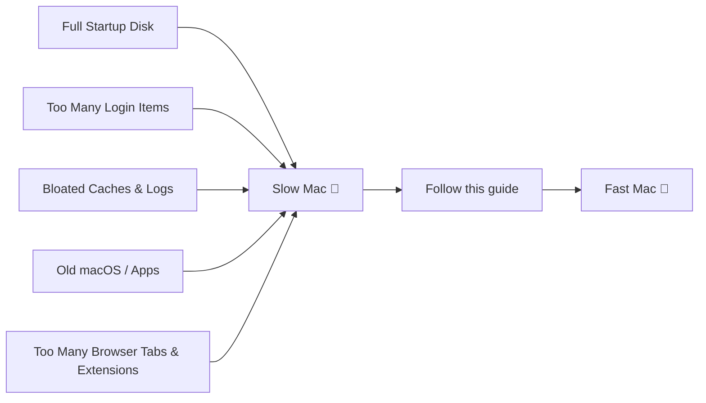

<div align="center">


# 🧹 macOS Cleanup & Speed-Up Guide

**A practical, no-nonsense guide to cleaning junk, freeing up disk space, and making your Mac feel new again.**


</div>

---

## 📑 Table of Contents

- [Why Your Mac Slows Down](#-why-your-mac-slows-down)
- [Quick Health Check](#-quick-health-check)
- [1. Free Up Disk Space](#1-%EF%B8%8F-free-up-disk-space)
- [2. Clean System & App Caches](#2-%EF%B8%8F-clean-system--app-caches)
- [3. Tame Startup & Background Apps](#3--tame-startup--background-apps)
- [4. Speed Up the System Itself](#4--speed-up-the-system-itself)
- [5. Keep It Fast — Maintenance Routine](#5--keep-it-fast--maintenance-routine)
- [Recommended Tools](#-recommended-tools)
- [Before / After Checklist](#-before--after-checklist)
- [FAQ](#-faq)

---

## 🐢 Why Your Mac Slows Down



Over time, macOS accumulates cache files, duplicate downloads, forgotten apps, and background processes that quietly eat your CPU, RAM, and disk space. None of this is dangerous — it's just clutter. This guide removes it safely.

> ⚠️ **Before you start:** back up important files with **Time Machine** or an external drive. None of the steps below are destructive if followed correctly, but it's always good practice.

---

## 🩺 Quick Health Check

Open **Terminal** (`Cmd + Space` → type `Terminal`) and run these to see your current state:

```bash
# Check available disk space
df -h /

# Check memory pressure & top processes
top -o mem

# See macOS version
sw_vers
```

| Symptom | Likely Cause |
|---|---|
| Fans spinning constantly | Runaway background process |
| Beachball cursor / freezing | Low free RAM or full disk (< 10% free) |
| Slow boot | Too many login items |
| Spotlight search is slow | Index needs rebuilding |
| App launch delay | Cold cache / low disk space |

---

## 1. 🗑️ Free Up Disk Space

macOS needs **at least 10–15% free disk space** to run smoothly (for swap, Time Machine snapshots, and system caches).

### Built-in Storage Manager
**Apple menu (🍎) → About This Mac → More Info → Storage → Manage...**

This shows a breakdown by category and lets you enable:
- **Optimize Storage** — automatically removes watched TV shows/movies
- **Empty Trash Automatically** — deletes items in Trash after 30 days
- **Store in iCloud** — offloads rarely-used files and photos

### Find what's actually eating space
```bash
# Find the 20 largest files on your Mac
sudo find / -type f -size +500M -exec ls -lh {} \; 2>/dev/null | sort -k5 -rh | head -20

# See folder sizes in your home directory, sorted
du -sh ~/* 2>/dev/null | sort -rh | head -20
```

### Common space hogs to check manually

| Location | What's there | Safe to clear? |
|---|---|---|
| `~/Downloads` | Installers, old zips | ✅ Yes, review first |
| `~/Library/Caches` | App caches | ✅ Yes (see §2) |
| `~/Library/Application Support/MobileSync/Backup` | Old iPhone backups | ✅ If unneeded |
| `~/Library/Containers` | Sandboxed app data | ⚠️ Only unused apps' data |
| `/private/var/vm` | Swap / sleepimage | ❌ Managed by macOS |
| `~/Movies`, `~/Music/Music/Media` | Media libraries | ✅ Move to external drive |

---

## 2. 🧽 Clean System & App Caches

Caches speed things up short-term but can bloat over years of use.

```bash
# Clear user cache (safe — apps will just rebuild what they need)
rm -rf ~/Library/Caches/*

# Clear system logs older than 7 days
sudo rm -rf /private/var/log/asl/*.asl

# Empty the Trash from Terminal
rm -rf ~/.Trash/*
```

> 💡 **Tip:** Never delete anything inside `/System/Library` or `/Library/Caches` at the **root** level without knowing exactly what it is — stick to `~/Library` (your user folder).

### Reset Mail, Photos & iMessage caches (if they feel sluggish)
- **Mail:** Mailbox menu → `Rebuild` on individual mailboxes
- **Photos:** Hold `⌘ + Option` while opening Photos → repair the library
- **Messages:** `~/Library/Messages/Attachments` often holds gigabytes of old media

---

## 3. 🚀 Tame Startup & Background Apps

Fewer things starting at login = faster boot and more free RAM immediately.

**System Settings → General → Login Items & Extensions**

- Remove anything you didn't add yourself
- Disable "Allow in the Background" for apps you rarely use

### Check what's silently running
```bash
# List all currently running apps and their memory footprint
ps aux | sort -nrk 4 | head -15
```

Open **Activity Monitor** (`Cmd + Space` → "Activity Monitor") and check the **Energy** tab — it flags apps draining battery/CPU even when minimized.

---

## 4. ⚡ Speed Up the System Itself

| Action | How | Effect |
|---|---|---|
| **Update macOS** | System Settings → General → Software Update | Fixes known performance bugs |
| **Rebuild Spotlight index** | `sudo mdutil -E /` | Fixes slow/broken search |
| **Reset NVRAM/PRAM** (Intel Macs) | Shut down → hold `Option+Cmd+P+R` at boot | Clears low-level display/audio glitches |
| **Reduce visual effects** | System Settings → Accessibility → Display → *Reduce motion / transparency* | Snappier UI on older Macs |
| **Check for malware/adware** | Use **Malwarebytes for Mac** (free scan) | Removes hidden CPU-hogging junk |
| **Repair disk permissions** | `Disk Utility → First Aid` | Fixes filesystem-level slowdowns |
| **Reset SMC** (Intel Macs) | Shut down → hold `Ctrl+Option+Shift+Power` 7s | Fixes fan/battery-related lag |

```bash
# Verify and repair disk from Terminal (Apple Silicon & Intel)
diskutil verifyVolume /
```

---

## 5. 🔁 Keep It Fast — Maintenance Routine


- ✅ **Weekly:** clear Downloads, empty Trash, restart your Mac (a full restart, not just sleep)
- ✅ **Monthly:** run Disk Utility First Aid, clear caches, review Login Items
- ✅ **Quarterly:** audit large files, uninstall unused apps, update everything

---

## 🛠️ Recommended Tools

| Tool | Purpose | Free? |
|---|---|---|
| **Disk Utility** (built-in) | Repair disk, check volumes | ✅ |
| **Activity Monitor** (built-in) | Find resource-hungry processes | ✅ |
| **OmniDiskSweeper** | Visual disk space explorer | ✅ |
| **AppCleaner** | Fully uninstall apps + leftovers | ✅ |
| **Malwarebytes for Mac** | Adware/malware scan | ✅ (scan) |
| **CleanMyMac X** | All-in-one cleanup suite | 💰 Paid |

> Avoid random "Mac speed booster" apps from pop-up ads — many are themselves adware. Stick to well-known, reviewed tools.

---

## ✅ Before / After Checklist

- [ ] Backed up via Time Machine
- [ ] Freed up disk space (≥ 15% free)
- [ ] Cleared user caches & Trash
- [ ] Trimmed Login Items
- [ ] Updated macOS & all apps
- [ ] Ran Disk Utility First Aid
- [ ] Rebuilt Spotlight index
- [ ] Restarted the Mac

---

## ❓ FAQ

<details>
<summary><strong>Will clearing caches delete my passwords or files?</strong></summary>
No. Caches are temporary data apps regenerate automatically. Your documents, photos, and saved passwords (Keychain) are untouched.
</details>

<details>
<summary><strong>My Mac is still slow after all this — what now?</strong></summary>
Check <code>Activity Monitor → CPU</code> for a single process stuck at high usage, check available RAM under <code>Memory</code>, and consider whether your Mac's hardware (especially RAM on older Intel models) is simply due for an upgrade.
</details>

<details>
<summary><strong>Is it safe to run <code>sudo rm -rf</code> commands?</strong></summary>
Only run the exact commands shown here, scoped to your user folder (<code>~/Library/...</code>). Never run <code>rm -rf</code> on root-level system folders — that can break macOS.
</details>

---

<div align="center">

Made with ☕ for people whose Mac fans sound like a jet engine.

⭐ **If this helped, consider starring the repo!**

</div>
